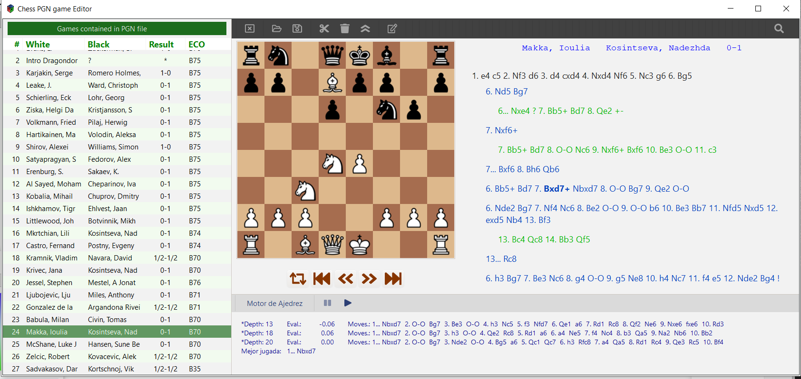
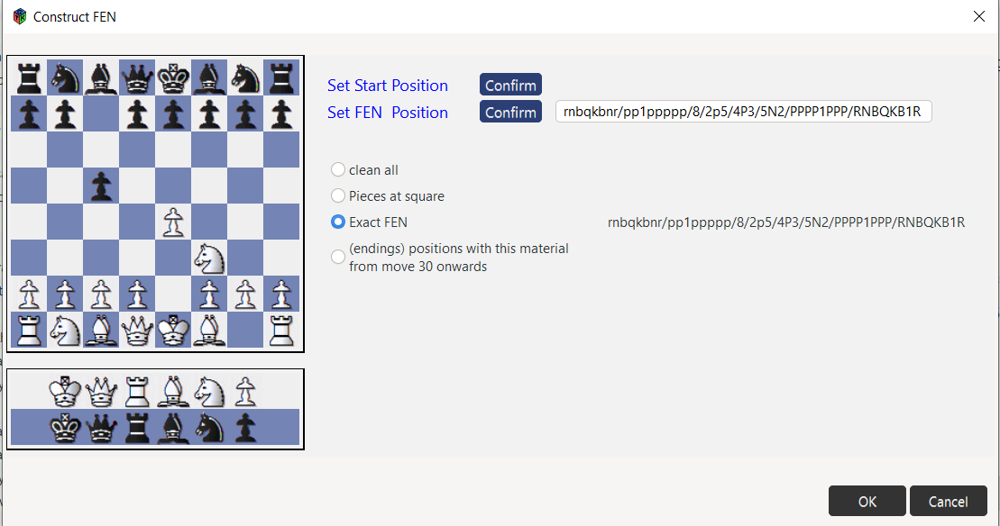
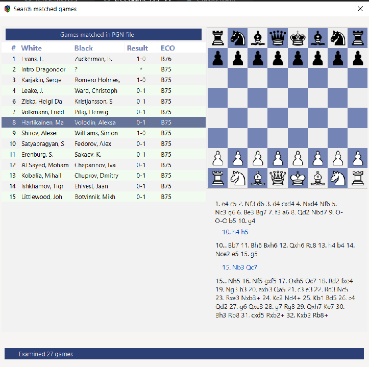

## rsChessPgnEditor

Created with Rustc and GTK3+

Arranged some little bugs:

When a comment of game starts with [Black has ... etc; and produces problems with standard header ([Black "Petrosian"]). For instance

21. Qe2 Nxf5 22. Bc4+ Kh8 23. Rd1 {[Now if ... of the bishop b7.]} Rae8 {
[Black wants to consolidate his position, transferring the rook to e5.]} {[#]}
24. b4 $5 {[It seems ... wins a pawn.]} axb4

is arranged.

Arranged problem when some variation start with comments.
Arranged problem when a pawn promotes with check (+) or mate (#).
Arranged number of fullmoves when set/get fen.

When a game contains some erroneous move, now continues smoothly (no panic!)

Now accepts null moves (SAN = '--').

Added algebraic coordinates to board.

>Open, parse, and display PGN chess files into a gtk::TreeView. 
>Shows every game, which can be edited on board, analyzed, and saved as pgn file.

>Also positions and material can be searched

>So we can replay every game matched with previous conditions

